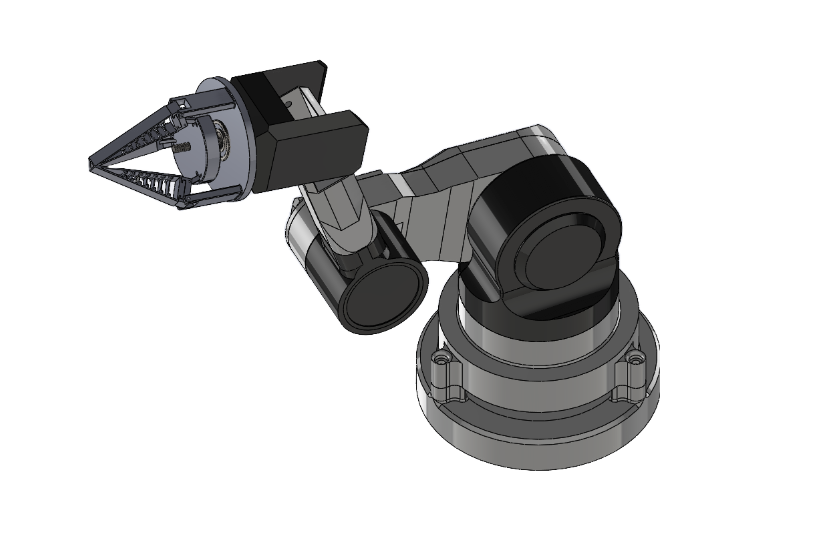
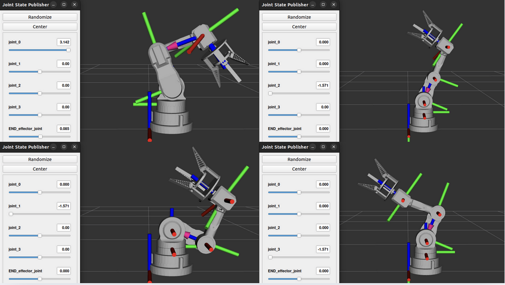
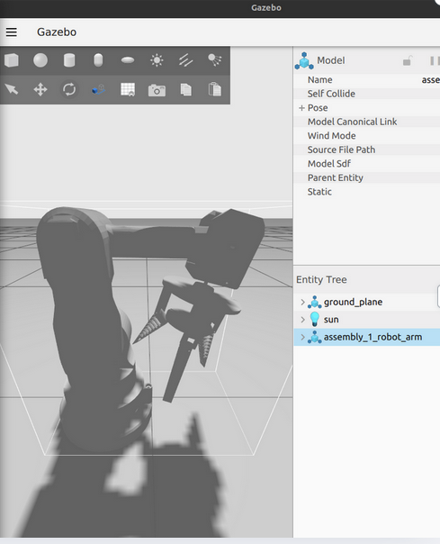

🦾 Sorting Robot Arm (Graduation Project)
🎯 Overview

A brief summary of your project:

The Sorting Robot Arm is a ROS 2-based robotic system designed to detect and sort oranges according to their maturity using computer vision. It integrates a 4-DOF robotic arm and a servo gripper, controlled via Arduino, and visualized in RViz and Gazebo.

⚙️ System Architecture

Components:

ROS 2 Humble — middleware for communication between nodes

Camera Node — captures images and publishes them as ROS Image messages

Maturity Detector Node — processes images with OpenCV to detect ripeness level

Inverse Kinematics Node — calculates arm joint angles to reach target positions

Serial Servo Node — communicates with Arduino to move the arm and gripper

Arduino Controller — executes motor commands and controls gripper servo

You can also include a system diagram (I can help you draw one if you want).

🧠 Features

Orange maturity detection using color segmentation (OpenCV + NumPy)

ROS 2 services and topics for modular communication

Real-time control of 4-DOF robotic arm via serial connection

Visualization and simulation in RViz and Gazebo

Automated sorting based on orange ripeness levels

Visualization:

